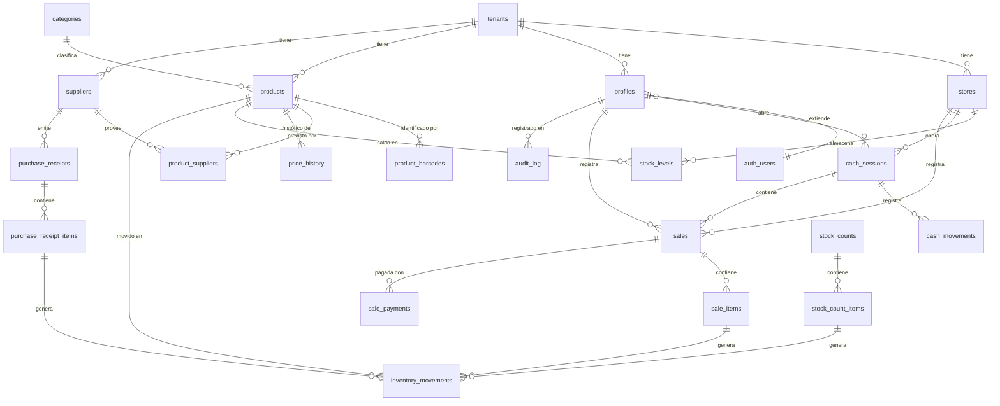

# 06 — Modelo de datos

Motor: **PostgreSQL 15+** (Supabase, región `ca-central-1`).

---

## 1. Principios de diseño

Cinco reglas que explican por qué el esquema es como es:

1. **Multi-tenant desde el día 1.** Toda tabla de negocio lleva `tenant_id`. Hoy
   hay un solo local; el modelo de negocio es SaaS. Agregar `tenant_id` después
   es una migración dolorosa; ponerlo ahora no cuesta nada. Ver
   [ADR-004](adr/ADR-004-multi-tenant.md).
2. **El kardex es la verdad.** El stock no es un número que se edita: es el saldo
   de una secuencia de movimientos inmutables. Si el saldo y el kardex no
   coinciden, el kardex tiene la razón. Esto es lo que permite auditar una
   diferencia seis meses después.
3. **Nada se borra.** Productos, usuarios y ventas se desactivan o anulan; nunca
   se eliminan. Un `DELETE` destruye la trazabilidad.
4. **El dinero es entero.** Los montos en CLP son `integer`. El punto flotante
   para dinero produce diferencias de $1 que hacen desconfiar de todo el sistema.
5. **La seguridad vive en la base de datos.** RLS en el 100 % de las tablas. La
   interfaz esconde botones por comodidad; la base impide el acceso de verdad.

---

## 2. Diagrama entidad-relación



---

## 3. Diccionario de datos

### 3.1 Núcleo multi-tenant

#### `tenants` — el cliente contratante
| Columna | Tipo | Notas |
|---|---|---|
| `id` | `uuid` PK | |
| `name` | `text` | "RutaAhorro" |
| `rut` | `text` | RUT de la empresa, validado |
| `plan` | `text` | `completo` |
| `status` | `text` | `activo` · `suspendido` · `cancelado` |
| `settings` | `jsonb` | IVA, % descuento máx. por rol, horario, moneda |
| `created_at` | `timestamptz` | |

#### `stores` — local o sucursal
| Columna | Tipo | Notas |
|---|---|---|
| `id` | `uuid` PK | |
| `tenant_id` | `uuid` FK | |
| `name`, `address`, `phone` | `text` | |
| `is_active` | `boolean` | |

> En la v1.0 existe **una sola** tienda por tenant. La tabla existe para no
> reescribir el esquema cuando el cliente abra un segundo local (FA-6).

#### `profiles` — extensión de `auth.users`
| Columna | Tipo | Notas |
|---|---|---|
| `id` | `uuid` PK FK → `auth.users.id` | |
| `tenant_id` | `uuid` FK | |
| `store_id` | `uuid` FK | tienda donde opera |
| `full_name` | `text` | |
| `role` | `user_role` | enum: `admin`,`supervisor`,`vendedor`,`bodega` |
| `is_active` | `boolean` | desactivar ≠ borrar |
| `max_discount_pct` | `numeric(5,2)` | tope de descuento del usuario |
| `last_seen_at` | `timestamptz` | |

> La contraseña **nunca** vive aquí: la administra `auth.users` (Supabase Auth).

### 3.2 Catálogo

#### `categories`
`id` · `tenant_id` · `name` · `sort_order` · `is_active`

#### `products`
| Columna | Tipo | Notas |
|---|---|---|
| `id` | `uuid` PK | |
| `tenant_id` | `uuid` FK | |
| `sku` | `text` | código interno, único por tenant |
| `name` | `text` | |
| `description` | `text` | |
| `category_id` | `uuid` FK | |
| `unit` | `text` | `unidad`, `kg`, `litro`, `paquete` |
| `sale_price` | `integer` | **CLP con IVA incluido** |
| `avg_cost` | `integer` | costo promedio ponderado, mantenido por el sistema |
| `last_cost` | `integer` | último costo de compra, informativo |
| `min_stock` | `numeric(14,3)` | umbral de alerta |
| `image_url` | `text` | Supabase Storage |
| `is_active` | `boolean` | |
| `created_at`, `updated_at` | `timestamptz` | |

> **`avg_cost` no se edita a mano.** Lo recalcula la función de recepción. Ver §5.2.

#### `product_barcodes` — un producto, varios códigos
| Columna | Tipo | Notas |
|---|---|---|
| `id` | `uuid` PK | |
| `tenant_id`, `product_id` | `uuid` FK | |
| `barcode` | `text` | |
| `is_primary` | `boolean` | |

Restricción: `UNIQUE (tenant_id, barcode)` — un código no puede apuntar a dos
productos dentro del mismo local (RF-M2-03).

#### `price_history`
`id` · `tenant_id` · `product_id` · `old_price` · `new_price` · `changed_by` ·
`changed_at` · `reason`
Se llena por *trigger* al actualizar `products.sale_price`. **Solo INSERT.**

### 3.3 Proveedores y compras

#### `suppliers`
`id` · `tenant_id` · `name` · `rut` · `contact_name` · `phone` · `email` ·
`notes` · `is_active`

#### `product_suppliers`
`product_id` · `supplier_id` · `supplier_sku` · `last_cost` — PK compuesta.

#### `purchase_receipts` — recepción de mercadería
| Columna | Tipo | Notas |
|---|---|---|
| `id` | `uuid` PK | |
| `tenant_id`, `store_id`, `supplier_id` | `uuid` FK | |
| `document_type` | `text` | `guia` · `factura` · `boleta` · `sin_documento` |
| `document_number` | `text` | |
| `received_at` | `timestamptz` | |
| `total_amount` | `integer` | CLP |
| `status` | `text` | `confirmada` · `anulada` |
| `created_by`, `voided_by` | `uuid` FK | |
| `void_reason` | `text` | |

#### `purchase_receipt_items`
`id` · `receipt_id` · `product_id` · `quantity numeric(14,3)` ·
`unit_cost integer` · `subtotal integer`

### 3.4 Inventario

#### `stock_levels` — saldo actual (tabla derivada)
| Columna | Tipo | Notas |
|---|---|---|
| `tenant_id`, `store_id`, `product_id` | `uuid` | PK compuesta |
| `quantity` | `numeric(14,3)` | |
| `updated_at` | `timestamptz` | |

> Es una **caché** del kardex, mantenida por *trigger*. Existe porque el POS
> necesita leer el stock en milisegundos y no puede sumar el kardex completo en
> cada escaneo. Debe poder reconstruirse enteramente desde `inventory_movements`
> (ver §5.4).

#### `inventory_movements` — el kardex (**inmutable**)
| Columna | Tipo | Notas |
|---|---|---|
| `id` | `uuid` PK | |
| `tenant_id`, `store_id`, `product_id` | `uuid` FK | |
| `movement_type` | `movement_type` | enum, ver abajo |
| `quantity` | `numeric(14,3)` | **con signo**: positivo entra, negativo sale |
| `balance_after` | `numeric(14,3)` | saldo tras el movimiento |
| `unit_cost` | `integer` | costo al momento del movimiento |
| `reference_type` | `text` | `sale` · `purchase_receipt` · `adjustment` · `stock_count` |
| `reference_id` | `uuid` | id del documento origen |
| `reason` | `text` | obligatorio en ajustes y mermas |
| `created_by` | `uuid` FK | |
| `created_at` | `timestamptz` | |

Enum `movement_type`:
`inventario_inicial` · `venta` · `anulacion_venta` · `recepcion` ·
`anulacion_recepcion` · `ajuste_positivo` · `ajuste_negativo` · `merma` ·
`toma_inventario`

**Reglas duras** (implementadas como políticas + *triggers*, no como convención):
- Sin `UPDATE`. Sin `DELETE`. Ni siquiera para `admin`.
- Corregir = insertar el movimiento compensatorio correspondiente.

#### `stock_counts` / `stock_count_items` — toma de inventario
`stock_counts`: `id` · `tenant_id` · `store_id` · `status` (`en_progreso`·`aplicada`·`anulada`) ·
`scope` (categoría o total) · `started_by` · `started_at` · `applied_at`
`stock_count_items`: `count_id` · `product_id` · `system_qty` · `counted_qty` ·
`difference` (generada) · `counted_at`

### 3.4.1 Lotes y vencimiento (perecibles)

Ver [ADR-007](adr/ADR-007-lotes-vencimiento.md). El control por lote es **opt-in
por producto**: `products.tracks_expiry`.

#### `product_lots`
`id` · `tenant_id` · `store_id` · `product_id` · `lot_code` · **`expiry_date`** ·
`quantity numeric(14,3)` · `unit_cost` · `receipt_id` · `is_active`

Índice FEFO: `(tenant_id, store_id, product_id, expiry_date asc)` filtrado por
`is_active and quantity > 0`. Es el índice que hace barato descontar del lote que
vence primero en cada venta.

#### `sale_item_lots`
`sale_item_id` · `lot_id` · `quantity`

> Registra de qué lote salió cada unidad vendida. Sin esta tabla, anular una
> venta no podría devolver las unidades al lote correcto y el control de
> vencimientos quedaría corrupto tras la primera anulación.

`inventory_movements` y `purchase_receipt_items` llevan `lot_id` / `expiry_date`
cuando aplica.

### 3.5 Ventas

#### `sales`
| Columna | Tipo | Notas |
|---|---|---|
| `id` | `uuid` PK | |
| `tenant_id`, `store_id` | `uuid` FK | |
| `folio` | `bigint` | correlativo **por tenant** |
| `cash_session_id` | `uuid` FK | |
| `sold_by` | `uuid` FK → `profiles` | |
| `sold_at` | `timestamptz` | hora real de la venta (¡no la de sincronización!) |
| `synced_at` | `timestamptz` | cuándo llegó al servidor |
| `subtotal`, `discount_total`, `total` | `integer` | CLP |
| `tax_amount` | `integer` | IVA contenido, informativo |
| `status` | `text` | `completada` · `anulada` |
| `voided_by`, `voided_at`, `void_reason` | | |
| `client_uuid` | `uuid` | **clave de idempotencia generada en el celular** |

> `client_uuid` con `UNIQUE (tenant_id, client_uuid)` es lo que hace segura la
> sincronización offline: si el celular reenvía una venta porque no recibió la
> respuesta, el servidor la reconoce y no la duplica (US-15).
> `sold_at` ≠ `synced_at`: una venta offline de las 14:30 sincronizada a las 18:00
> **es una venta de las 14:30** para todo efecto de reporte y caja.

#### `sale_items`
`id` · `sale_id` · `product_id` · `product_name` (**copia**) · `quantity` ·
`unit_price` (**copia**) · `unit_cost` (**copia**) · `discount_amount` · `subtotal`

> Los campos marcados como copia se **congelan** al momento de la venta. Si mañana
> cambia el precio o el nombre del producto, el histórico no debe mutar: el reporte
> de margen de marzo tiene que seguir dando lo mismo en diciembre.

#### `sale_payments`
`id` · `sale_id` · `method` (`efectivo`·`debito`·`credito`·`transferencia`) ·
`amount integer` · `received_amount integer` · `change_amount integer`
Varias filas por venta habilitan el pago mixto (RF-M5-10).

### 3.6 Caja

#### `cash_sessions`
| Columna | Tipo | Notas |
|---|---|---|
| `id` | `uuid` PK | |
| `tenant_id`, `store_id`, `user_id` | `uuid` FK | |
| `opened_at`, `closed_at` | `timestamptz` | |
| `opening_amount` | `integer` | declarado al abrir |
| `expected_amount` | `integer` | calculado al cerrar |
| `counted_amount` | `integer` | conteo físico |
| `difference` | `integer` | `counted − expected` (columna generada) |
| `status` | `text` | `abierta` · `cerrada` |
| `closing_notes` | `text` | obligatorio si `difference <> 0` |
| `closed_by` | `uuid` FK | distinto de `user_id` si fue cierre forzado |

Índice único parcial — **una sola caja abierta por usuario** (RF-M6-09):
```sql
CREATE UNIQUE INDEX one_open_session_per_user
  ON cash_sessions (user_id) WHERE status = 'abierta';
```

#### `cash_movements`
`id` · `cash_session_id` · `type` (`ingreso`·`egreso`) · `amount integer` ·
`reason text NOT NULL` · `created_by` · `created_at`

### 3.7 Transversales

#### `audit_log` — bitácora (**inmutable**)
`id` · `tenant_id` · `user_id` · `action` · `entity_type` · `entity_id` ·
`old_values jsonb` · `new_values jsonb` · `ip_address inet` ·
`user_agent text` · `created_at`

Acciones auditadas: `price_change`, `stock_adjustment`, `sale_void`,
`receipt_void`, `cash_force_close`, `user_create`, `user_deactivate`,
`role_change`, `settings_change`, `data_export`.

#### `alerts`
`id` · `tenant_id` · `type` · `severity` · `payload jsonb` · `is_read` ·
`created_at` · `read_at` · `read_by`

---

## 4. Índices

```sql
-- Búsqueda del POS: el camino más caliente del sistema
CREATE UNIQUE INDEX ON product_barcodes (tenant_id, barcode);
CREATE INDEX ON products USING gin (to_tsvector('spanish', name));
CREATE INDEX ON products (tenant_id, is_active) WHERE is_active;

-- Reportes de ventas por período
CREATE INDEX ON sales (tenant_id, sold_at DESC);
CREATE INDEX ON sales (cash_session_id);
CREATE INDEX ON sale_items (sale_id);
CREATE INDEX ON sale_items (product_id, sale_id);

-- Kardex por producto y fecha
CREATE INDEX ON inventory_movements (tenant_id, product_id, created_at DESC);
CREATE INDEX ON inventory_movements (reference_type, reference_id);

-- Idempotencia de la sincronización offline
CREATE UNIQUE INDEX ON sales (tenant_id, client_uuid);

-- Alerta de stock bajo mínimo
CREATE INDEX ON stock_levels (tenant_id, product_id);
```

---

## 5. Lógica en la base de datos

Las operaciones que deben ser **atómicas o no ocurrir** viven en funciones
PL/pgSQL, no en el cliente. Un celular que pierde señal a mitad de una venta no
puede dejar el stock descontado y la venta sin registrar.

### 5.1 `fn_register_sale(...)` — registro de venta
Transacción única que:
1. Verifica que el usuario tenga caja abierta.
2. Verifica idempotencia por `client_uuid`; si ya existe, devuelve la venta existente.
3. Asigna el `folio` correlativo.
4. Inserta `sales`, `sale_items`, `sale_payments`, copiando precio y costo vigentes.
5. Inserta un `inventory_movements` por línea y actualiza `stock_levels`.
6. Devuelve la venta completa.

### 5.2 `fn_confirm_receipt(...)` — recepción y costo promedio
Al confirmar, por cada línea recalcula:

```
nuevo_costo_promedio = (stock_actual × costo_promedio_actual + cantidad_recibida × costo_unitario)
                       ÷ (stock_actual + cantidad_recibida)
```

Casos que la función maneja explícitamente:
- Stock actual **cero o negativo** → el costo promedio pasa a ser el costo de compra.
- Resultado redondeado **al entero más cercano** (CLP no tiene decimales).

### 5.3 `fn_close_cash_session(...)` — arqueo
Calcula `expected_amount = opening_amount + ventas_en_efectivo + ingresos − egresos`,
lo compara con el conteo físico, exige nota si hay diferencia y bloquea la sesión.

### 5.4 `fn_rebuild_stock_levels(tenant, store)` — reconstrucción
Recalcula `stock_levels` desde cero sumando el kardex. Es la red de seguridad que
justifica tener una tabla derivada: si alguna vez se desincroniza, se reconstruye.
Debe ejecutarse mensualmente como verificación y compararse con el valor vigente.

### 5.6 `fn_consume_lots(...)` — descuento FEFO
Recorre los lotes activos del producto ordenados por `expiry_date` ascendente y
descuenta hasta cubrir la cantidad vendida, registrando el consumo en
`sale_item_lots`. Si la cantidad excede lo disponible en lotes, **no bloquea**:
deja el sobrante como `unallocated` para que el descuadre quede visible (ADR-005).

### 5.7 `fn_write_off_lot(...)` — baja de lote vencido
Genera un movimiento `merma` por el saldo del lote, lo desactiva y registra en la
bitácora.

### 5.5 Triggers
| Trigger | Sobre | Hace |
|---|---|---|
| `trg_price_history` | `products` UPDATE | registra el cambio de `sale_price` |
| `trg_audit` | tablas sensibles | inserta en `audit_log` |
| `trg_block_modify` | `inventory_movements`, `audit_log` | rechaza todo `UPDATE`/`DELETE` |
| `trg_stock_level` | `inventory_movements` INSERT | actualiza `stock_levels` |
| `trg_low_stock_alert` | `stock_levels` UPDATE | crea alerta al cruzar `min_stock` |

---

## 6. Row Level Security

### 6.1 Regla base — aislamiento entre locales
RLS habilitado en **todas** las tablas. La función auxiliar:

```sql
CREATE FUNCTION auth.tenant_id() RETURNS uuid
LANGUAGE sql STABLE SECURITY DEFINER AS $$
  SELECT tenant_id FROM public.profiles WHERE id = auth.uid();
$$;
```

Política base, replicada en toda tabla de negocio:

```sql
CREATE POLICY tenant_isolation ON products
  FOR ALL TO authenticated
  USING (tenant_id = auth.tenant_id())
  WITH CHECK (tenant_id = auth.tenant_id());
```

### 6.2 Reglas por rol
Traducción directa de la matriz de [02 §4](02-stakeholders-roles.md). Ejemplos:

```sql
-- El vendedor NO puede ver costos: se le expone una vista sin esas columnas
CREATE VIEW products_public AS
  SELECT id, tenant_id, sku, name, category_id, unit,
         sale_price, image_url, is_active
  FROM products;

-- Solo admin y supervisor pueden modificar productos
CREATE POLICY products_write ON products
  FOR UPDATE TO authenticated
  USING (tenant_id = auth.tenant_id()
         AND auth.user_role() IN ('admin','supervisor'));

-- El vendedor solo ve sus propias ventas
CREATE POLICY sales_read ON sales
  FOR SELECT TO authenticated
  USING (tenant_id = auth.tenant_id()
         AND (auth.user_role() IN ('admin','supervisor')
              OR sold_by = auth.uid()));

-- Nadie modifica el kardex: sin política de UPDATE ni DELETE, queda prohibido
CREATE POLICY movements_insert ON inventory_movements
  FOR INSERT TO authenticated
  WITH CHECK (tenant_id = auth.tenant_id());
```

### 6.3 Prueba obligatoria de RLS
Antes de cada despliegue a producción, un test automatizado debe verificar:

1. **Ninguna** tabla de `public` tiene `rowsecurity = false` (RNF-24).
2. Un usuario del tenant A no lee **ninguna** fila del tenant B en ninguna tabla.
3. Un `vendedor` no puede leer `products.avg_cost`.
4. Un `UPDATE` sobre `inventory_movements` falla para todos los roles.

```sql
-- Test 1: no debe devolver ninguna fila
SELECT tablename FROM pg_tables
WHERE schemaname = 'public' AND NOT rowsecurity;
```

---

## 7. Retención de datos

| Dato | Retención | Justificación |
|---|---|---|
| Ventas y kardex | **Indefinida** | Trazabilidad y respaldo tributario del cliente |
| Bitácora de auditoría | Mínimo 2 años | Investigación de diferencias |
| Respaldos diarios | 30 días | RF-M9-02 |
| Sesiones de autenticación | 30 días de inactividad | Seguridad |
| Imágenes de productos | Mientras exista el producto | |

Al término del contrato: exportación completa de datos al cliente y eliminación
dentro de 90 días, previa confirmación escrita.
